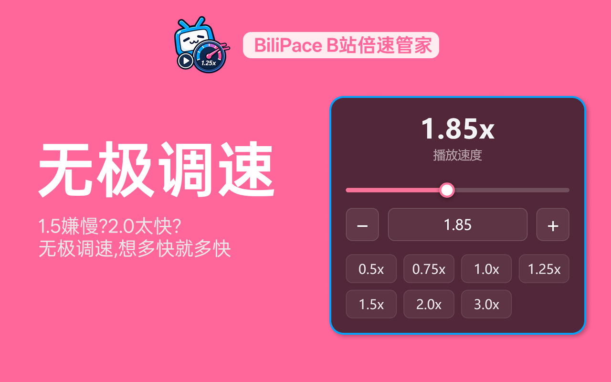

<p align="center">
  
</p>

<h1 align="center">BiliPace-B站倍速管家</h1>

<p align="center">
  <a href="https://microsoftedge.microsoft.com/addons/detail/bilipace-b%E7%AB%99%E5%80%8D%E9%80%9F%E7%AE%A1%E5%AE%B6/fcdfmgpfnbcbbjpopaggakdlfnkhjpbc"></a>
  <a href="https://chromewebstore.google.com/detail/bilipace-b%E7%AB%99%E5%80%8D%E9%80%9F%E7%AE%A1%E5%AE%B6/jladjpcgejlgoifofnonpinadilbdjib"></a>
</p>

<p align="center"><em>专为 Bilibili 设计的无极调速扩展,让每个视频的播放节奏都尽在掌握。</em></p>

<p align="center">
  <b>简体中文</b> · <a href="./README.en.md">English</a>
</p>

<p align="center">
  
</p>

BiliPace-B站倍速管家是一个 Chrome / Edge (Manifest V3) 浏览器扩展,专为 Bilibili 打造:**无极调速**,想多快就多快;**规则匹配**,让每个视频都有自己的速度;**无缝融合**,一样的位置,一样的味道。直接在播放器上完成所有操作,无需跳转、无需来回切换——你的节奏,你来掌握!

---

## 目录

- [功能特性](#功能特性)
- [安装](#安装)
- [使用说明](#使用说明)
- [标题倍速匹配](#标题倍速匹配)
- [文件结构](#文件结构)
- [变更日志](#变更日志)
- [许可证](#许可证)

---

## 功能特性

### ⚡ 无极调速

1.5 倍嫌慢?2.0 倍太快?无极调速,想多快就多快!支持拖动滑块、输入精确数值或点击加减按钮等多种方式灵活调整倍速,随心所欲,自在掌控。

<p align="center">
  
</p>

- **滑块连续调节**:无极精确调速(默认步进 0.01),倍速范围可在设置中自定义
- **精确输入**:直接在数值框中输入任意倍速(如 `1.37x`)
- **步进微调**:`+/−` 按钮按设定步长微调

### 🎯 规则匹配

学习想快?听歌要慢?规则匹配,让每个视频都有自己的速度!为包含不同关键词的视频设置不同倍速,例如「教程」2 倍速、「歌曲」1 倍速,根据内容自动匹配,无缝切换。

<p align="center">
  
</p>

- **标题关键词匹配**:视频标题包含关键词时自动套用对应倍速;可在设置中手动添加规则,或一键把当前页面的标题 + 当前倍速存为规则
- **优先级可控**:多条规则命中时取列表中最靠上的一条,拖拽左侧把手即可调整优先级
- **智能回退**:未命中任何规则的视频沿用上次记忆的倍速;标题切换(分P、页面跳转)时自动重新匹配

### ✨ 无缝融合

不想来回切换?无缝融合,一样的位置,一样的味道。扩展无缝融入 Bilibili 播放器原有控制面板,操作习惯无需改变,丝滑一体,浑然天成。

<p align="center">
  
</p>

- **替换原生倍速菜单**:悬停播放器右下角「倍速」按钮即可使用自定义微调面板,入口位置与操作习惯保持不变
- **保持同步**:监听 `ratechange` 等事件,外部改动(B 站快捷键等)与切换分P后自动同步
- **记忆倍速**:页面刷新或重新加载后自动恢复上次设置的播放速度
- **美观轻量**:小圆角半透明毛玻璃面板,契合 B 站粉色主题;未登录也可正常调速

### 🚀 更多实用功能

- **常用倍速一键切换**:0.5 / 0.75 / 1.0 / 1.25 / 1.5 / 2.0 / 3.0,可在设置中增删
- **灵活配置**:自定义倍速范围(0.1x ~ 4.0x)、滑块步进与 `+/−` 微调步长,拖拽调整关键词优先级

### 🔓 完全开源

项目完全开源,代码透明,放心使用。

---

## 安装

### 🛒 应用商店安装(推荐)

BiliPace 现已上架主流浏览器扩展商店,点击下方链接即可一键安装:

- **[Edge 扩展商店](https://microsoftedge.microsoft.com/addons/detail/bilipace-b%E7%AB%99%E5%80%8D%E9%80%9F%E7%AE%A1%E5%AE%B6/fcdfmgpfnbcbbjpopaggakdlfnkhjpbc)**:适用于 Microsoft Edge
- **[Chrome 应用商店](https://chromewebstore.google.com/detail/bilipace-b%E7%AB%99%E5%80%8D%E9%80%9F%E7%AE%A1%E5%AE%B6/jladjpcgejlgoifofnonpinadilbdjib)**:适用于 Google Chrome / 其他 Chromium 系浏览器

### 🧰 手动安装(开发者模式)

如需从源码手动安装,请按以下步骤操作:

1. 下载或克隆本项目到本地
2. 打开 `chrome://extensions`(Edge 为 `edge://extensions`)
3. 开启右上角「开发者模式」
4. 点击「加载已解压的扩展程序」,选择本项目根目录
5. 打开任意 B 站视频页面,悬停右下角「倍速」按钮即可使用微调面板

## 使用说明

- **悬停倍速按钮**展开微调面板,拖动滑块、输入数值、点击 `+/−` 或预设均可调节
- 点击工具栏扩展图标打开**设置面板**,可配置:

| 设置项 | 说明 | 默认值 |
| --- | --- | --- |
| 最小速度 | 滑块/输入允许的最小倍速 | 0.1 |
| 最大速度 | 滑块/输入允许的最大倍速 | 4.0 |
| 滑块步进 | 滑块拖动的最小变化量 | 0.01 |
| 微调步长 | `+/−` 按钮每次的变化量 | 0.05 |
| 常用倍速 | 面板底部的快捷预设(可增删行) | 0.5, 0.75, 1.0, 1.25, 1.5, 2.0, 3.0 |
| 标题匹配开关 | 是否启用标题关键词匹配倍速 | 开 |
| 标题关键词规则 | 「关键词 + 倍速」列表,标题包含关键词时自动套用该倍速(可拖拽左侧把手调整优先级,越靠上优先级越高) | 空 |

面板顶部的「当前默认倍速」会实时显示扩展记忆的默认播放倍速(在播放页上调节倍速后自动更新)。

所有设置通过 `chrome.storage.sync` 保存,修改后会在已打开的页面上即时生效。设置面板支持**自动保存**:输入框失焦、输入框内按 Enter、勾选切换、删除/步进操作,以及标题规则的拖拽 / 键盘排序后都会即刻写入,无需再点击「保存设置」;「保存设置」按钮保留作为手动兜底。

## 标题倍速匹配

- 勾选「启用标题匹配」后,播放器会读取页面标题(`.video-info-title h1.video-title`,取 `data-title` 或文本),按关键词做**不区分大小写的包含匹配**;多条规则命中时取**列表中最靠上的一条**(可通过左侧把手拖拽调整优先级,越靠上优先级越高)。
- 在设置面板中可**手动添加**关键词规则:输入关键词(如「操作系统」)和对应倍速,保存后即可生效。
- 点击「自动添加当前视频」,扩展会向当前标签页发送消息,读取正在播放视频的标题与当前倍速,自动生成一条规则(同名关键词已存在时仅更新倍速)。
- 未命中任何规则的视频沿用现有逻辑(恢复上次记忆的倍速)。标题切换(如分P切换、SPA 跳转)时自动重新匹配。

## 文件结构

```
BiliPlayRateFineTune/
├── manifest.json            # MV3 清单:权限、图标、popup、内容脚本声明
├── _locales/                # 国际化字典(zh_CN / en)
├── icons/                   # 图标 PNG(manifest 使用)
├── assets/                  # README 宣传图与文案
├── src/
│   ├── content/             # 内容脚本(按 manifest 顺序注入,共享 window.BPRFT 命名空间)
│   │   ├── config.js        # 常量、CONFIG、共享 state
│   │   ├── utils.js         # i18n、数值格式化、DOM 查询
│   │   ├── video.js         # 视频元素与倍速应用/持久化
│   │   ├── ui.js            # 播放器面板 UI
│   │   ├── title.js         # 标题关键词匹配
│   │   ├── boost.js         # 长按→方向键加速 + 原生提示
│   │   ├── main.js          # 入口:初始化与设置监听
│   │   └── content.css      # 播放器面板样式
│   └── popup/               # 设置面板(ES Modules)
│       ├── popup.html
│       ├── popup.css
│       └── js/              # i18n / config / dom / storage / presets / rules / stepper / panels / autosave
└── tools/                   # Playwright 端到端测试
    ├── e2e.mjs              # 测试入口:启动扩展并按顺序运行全部规格
    └── e2e/
        ├── harness.mjs      # 公共工具:启动浏览器、storage 读写、状态快照
        └── specs/           # 规格:popup / 核心调速 / 标题匹配 / 长按加速 / 切集 / 跨视频标签匹配 / 持久化
```

## 变更日志

以下汇总 `feat` 分支相对 `master` **独有**的变更(不含从 `master` 合并而来的内容),自 `00ff141` 起。

### 未发布 (Unreleased)

#### 🐛 修复

- **多集视频(分P)切集后倍速失效**:B 站切集 / 切换清晰度时会调用 `video.load()`,按规范会把 `playbackRate` 重置为 `defaultPlaybackRate`(通常为 1)并触发 `ratechange`;扩展此前会把这次程序性重置误判为用户意图,把期望倍速覆盖成 1。现在切源期间会忽略该 `ratechange` 并自动重新应用期望倍速,并以 `currentSrc` 变化作为兜底;倍速按钮文字也始终与期望值保持一致,不再回退为 `1.0x`。外部真实改速(切源窗口之外)仍会被采纳。

#### 🧪 测试

- 重整 e2e 测试套件:`tools/e2e.mjs` 作为统一入口,按功能拆分为 `tools/e2e/specs/` 下的 popup、核心调速、标题匹配、长按加速、切集、跨视频标签匹配、持久化等规格,共 **123** 项断言,覆盖全部功能。
- **多级标签匹配 / 跨视频切换回归**:新增 `content-switch` 规格,使用非多P视频验证标题含「歌」、「周杰伦」及两者兼有时按优先级命中规则,并覆盖完整页面跳转与站内 SPA 推荐位切换(切换后按新标题重新匹配)。

### `00ff141` — fix(ui)

- **全屏下预制倍速按钮显示异常**:`.bprft-chip` 增加 flex 布局并水平、垂直居中。

### `95ce11e` — feat

- **长按 `→` 加速**:在捕获阶段接管右方向键长按手势,将倍速提升至当前倍速的 **2 倍**。
- **复用原生提示 UI**:按原生结构创建 `.bpx-player-three-playrate-hint-loop`,复用播放器自带样式;左侧图标还原原生 lottie 三段箭头动画(透明度 15%↔80%,相位差 1/6 秒)。
- **提示轮播垂直居中**:仅保留当前倍速一项,移除上下相邻的半透明预设。
- **短按保留快进**:短按 `→` 仍快进 5 秒;窗口失焦 / 页面隐藏时自动取消加速。
- **修复**:B 站 1x 时按钮会被渲染为「倍速」而非数值的问题。
- **修复**:移除会把临时加速倍速写入 `desired` / `defaultRate` 的 result 观察器,且 `reapply` 不再监听 `ratechange`,避免加速倍速被固定且不写回默认值。
- **构建**:`manifest` 内容脚本改为 `document_start` 注入,确保监听早于 B 站脚本注册。

### `056d808` — refactor

- **目录整理**:图标 → `icons/`,内容脚本与样式 → `src/content/`,设置面板 → `src/popup/`。
- **内容脚本模块化**:拆分为 7 个模块(config / utils / video / ui / title / boost / main),按 manifest 顺序注入并共享 `window.BPRFT` 命名空间。
- **设置面板模块化**:改用 ES Modules,拆分为 i18n / dom / config / storage / presets / rules / stepper / panels。
- 更新 `manifest.json`、`popup.html` 与 README 中的资源及脚本路径。
- e2e 新增 popup 冒烟测试(模块加载、i18n、预设渲染、图标解析、无报错)。

行为无变化。

## 许可证

本项目基于 [MIT License](LICENSE) 开源发布:你可以自由地使用、复制、修改、合并、发布、分发、再许可及/或销售本软件的副本,唯一的条件是必须保留上述版权声明与本许可声明。

**Copyright (c) 2026 nulearrockstone**

完整许可条款见 [LICENSE](LICENSE) 文件。

---

**BiliPace,你的节奏,你来掌握!**
